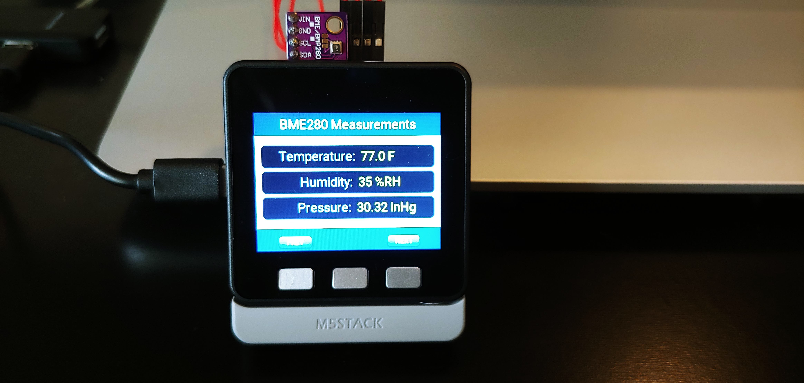
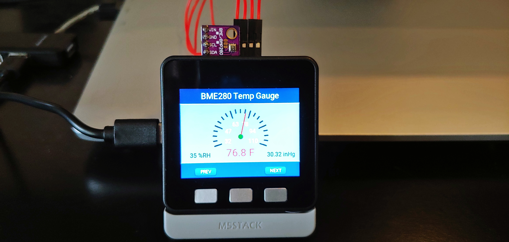
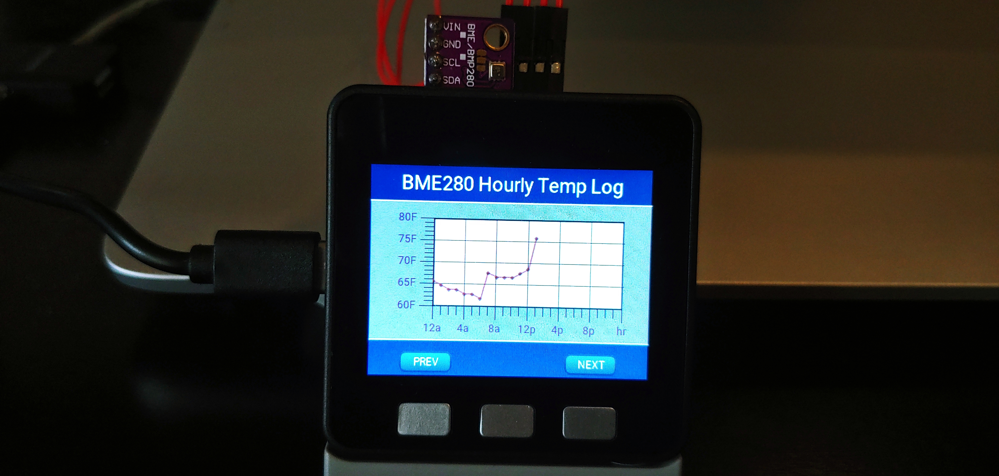
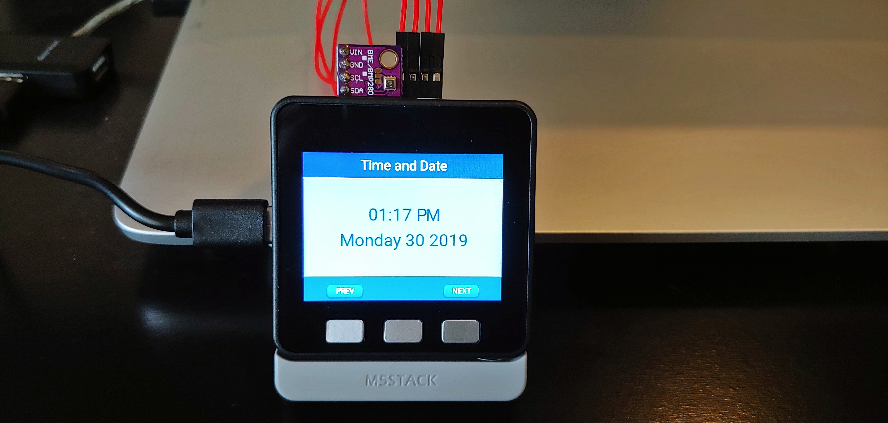

# M5StackBME280
M5Stack using Smooth C++ library and Littlevgl Graphics library to display BME280 data.

## Overview
This application shows how to use the Smooth C++ library and the LittlevGL Graphichs library
to display BME280 in three different views and a view to display the current date and time. 
The app has three tasks running besides the mainn Application Task.  The details about the
application memory usage, bin file size and versions of software used on this project are
listed at the top of the App.cpp file.

## Views
The following views are displayed by this application.
- Measurements View - displays numerical values of temp, humidity and pressure(sea level)
- Temperature Gauge View - displays temperature value in a gauge and numerical values of humidity and pressure
- Hourly Temp Log - display and hourly log of temperature over a 24 hour period
- Time and Date - displays the current time (MST) and current date

## A view
A view consists of a title bar, a content pane and a menu bar.  The title bar is at the top of the screen
and the title changes depending upon which view is selected.  The content pane varies depending upon the view 
selected and is positioned in the middle of the screen.  And lastly the menu bar is at the bottom of the screen
where the 3 hardware buttons on the M5Stack are located.  Two menu buttons are supported "NEXT" and "PREV".
The app uses LittlevGL input device driver to debounce the buttons.  The LittlevGL input device driver creates an
on-clicked event when the hw button is pressed and the released.  It also shows the gui button pressed or released
when the hardware button is pressed or released.

## Tasks
The app has 3 additional tasks running besides the Application Task. 
- ScanSensorTask - A task that periodically collects measurements(temperature, pressure, humidity) from the BME280.
- LvglTask - A tasks that runs LittlevGL graphics display.  All files in gui folder are running under this task.
- SntpTask - A task that runs SNTP.  Updates the local system time on Sntp TimeSyncEvents and publishes DateTimeValue.

## Pictures of the various views
The Measurements View

The Temperature Gauge View

The Temperature Hourly Log View

The Time and Date View

